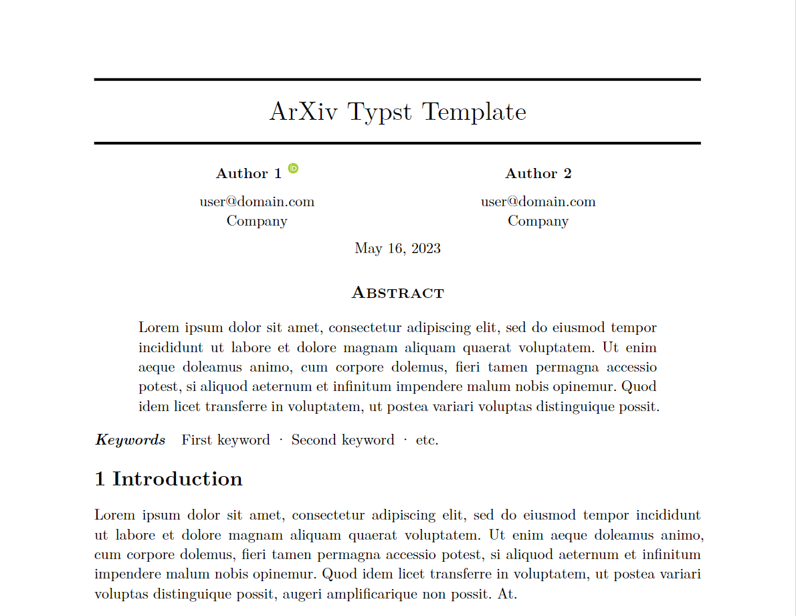

# arkheion

A Typst template based on popular LateX template used in arXiv and bio-arXiv. Inspired by [arxiv-style](https://github.com/kourgeorge/arxiv-style)



## Usage

**Import**

```
#import "@preview/arkheion:0.1.3": arkheion, arkheion-appendices
```

**Main body**

```
#show: arkheion.with(
  title: "ArXiv Typst Template",
  authors: (
    (name: "Author 1", email: "user@domain.com", affiliation: "Company", orcid: "0000-0000-0000-0000"),
    (name: "Author 2", email: "user@domain.com", affiliation: "Company"),
  ),
  // Insert your abstract after the colon, wrapped in brackets.
  // Example: `abstract: [This is my abstract...]`
  abstract: lorem(55),
  keywords: ("First keyword", "Second keyword", "etc."),
  date: "May 16, 2023",
)
```

**Table of contents**

Place `#outline()` after the `#show: arkheion.with(...)` rule. Appendices are listed as `A`, `A.1`, ... alongside the main sections.

```
#outline()

= Introduction
#lorem(60)
```

**Appendix**

```
#show: arkheion-appendices
=

== Appendix section

#lorem(100)

```

## API

### `arkheion.with`

- `title: String` - Title of the document.
- `authors: List<Author>` - List of authors.
```
Author: {
  name: String,
  email: String,
  affiliation: String,
  orcid: String
}
```
- `custom-authors: Content` - Custom authors content that overrides the default authors content.
Note: The `authors` is still required to be passed in order to generate the metadata, however, only the `name` field is required.
- `abstract: Content` - Abstract of the document.
- `keywords: List<String>` - List of keywords.
- `date: String` - Date of the document.

## License

[MIT](LICENSE)
